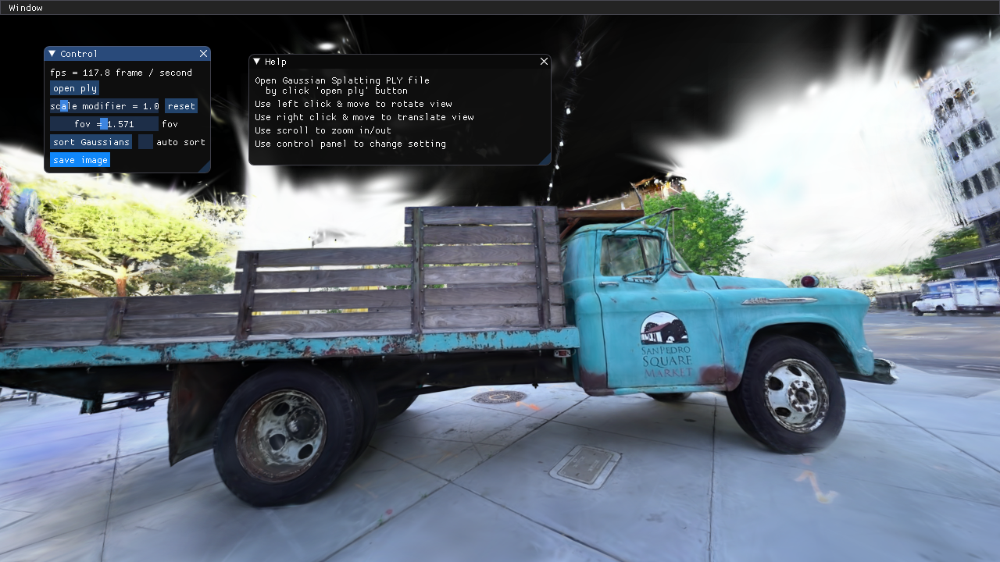
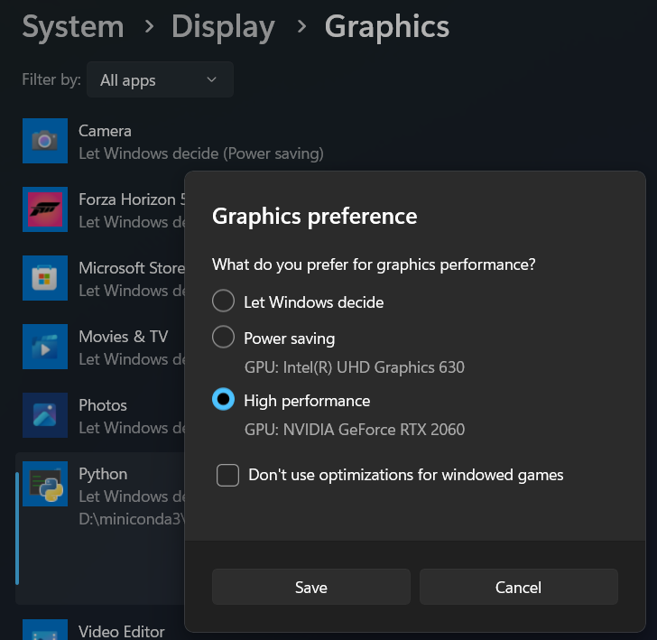

# Tiny Gaussian Splatting Viewer

This is a simple Gaussian Splatting Viewer built with PyOpenGL / CUDARasterizer. It's easy to install with minimum dependencies. The goal of this project is to provide a minimum example of the viewer for research and study purpose. 

# News!
1/10/2024: The OpenGL renderer has faster sorting backend with `torch.argsort` & `cupy.argsort`. With cuda based sorting, it achieves nearly real-time sorting with OpenGL backend.

12/21/2023: Now we support rendering using the official cuda rasterizer!

# Usage
Install the dependencies:
```
pip install -r requirements.txt
```

Launch the viewer:
```
python main.py
```

You can check how to use UI in the "help" panel.

The Gaussian file loader is compatiable with the official implementation. 
Therefore, download pretrained Gaussian PLY file from [this official link](https://repo-sam.inria.fr/fungraph/3d-gaussian-splatting/datasets/pretrained/models.zip), and select the "point_cloud.ply" you like by clicking the 'open ply' button, and you are all set!


# Optional dependencies:

- If you want to use `cuda` backend for rendering, please install the [diff-gaussian-rasterization](https://github.com/graphdeco-inria/diff-gaussian-rasterization) following the guidance [here](https://github.com/graphdeco-inria/gaussian-splatting). And also install the following package:
```
pip install cuda-python
```

- For sorting, we provide three backend: `torch`, `cupy`, and `cpu`. The implementation will choose the first available one based on this priority order: `torch -> cupy -> cpu`. If you have `torch` or `cupy` backend, turning on `auto sort` will achieve nearly real-time sorting.
    - If you want to use `torch` as sorting backend, install any version of [PyTorch](https://pytorch.org/get-started/locally/).

    - If you want to use `cupy` to accelerate sorting, you should install the following package:
    ```
    pip install cupy-cuda11x // for cuda 11
    pip install cupy-cuda12x // for cuda 12
    ```


# Troubleshoot

The rendering speed of is comparable to the official CUDA renderer. If you're experiencing slow rendering, it's likely you are using integrated graphics card instead of a high-performance one. You can configure python to use high-performance graphics card in system settings. In Windows, you can set in Setting > System > Display > Graphics. See the screenshot below for example.



# Limitations
- The implementation utilizes SSBO, which is only support by OpenGL version >= 4.3. Although this version is widely adopted, MacOS is an exception. As a result, this viewer does not support MacOS.

- The `cuda` backend currently does not support other visualizations.

- Based on the flip test between the two backends, the unofficial implementation seems producing slightly different results compared with the official cuda version.

# TODO
- Add orthogonal projection
- Make the projection matrix compatiable with official cuda implementation
- Tighter billboard to reduce number of fragments
- Save viewing parameters
